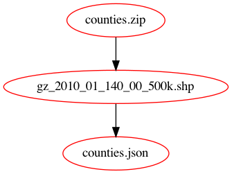

# Make file tool for reproducibility

## Introduction

Looking into reproducibility frameworks I came accross the simple idea of using `make` as the tool to keep track of dependencies and helping to only rerun code if data has been changed. [http://zmjones.com/make/](http://zmjones.com/make/).

One of the benefits of `make` is that is it language agnostic, so it can by used with Python, Stata or R.

Make can be a bit cryptic (I always denied it for that reason), but in essence it pretty basic and simple.

This project is loosely based on: [https://bost.ocks.org/mike/make/](https://bost.ocks.org/mike/make/).

There are frameworks available that specifically work with R or Python. See the references.

## Getting the example to work

### Tool for converting shape file (`ogr2ogr`)

This is only necessary for the example. We use `conda` for this.

```bash
conda install -c conda-forge gdal
```

## Running make:

```bash
make
```

Clean up all the files:

```bash
make clean
```

## Make file visualization

[Visualizing dependencies](https://unix.stackexchange.com/questions/400416/visualizing-dependencies-coded-up-in-makefiles-as-a-graph#576563)

Install `graphviz` for the visualization of the make file.(this includes `dot`)

[https://github.com/lindenb/makefile2graph](https://github.com/lindenb/makefile2graph)

Dependency on graphviz

```bash
brew install graphviz
```

### Set up

```bash
git clone https://github.com/lindenb/makefile2graph
cd makefile2graph
make
cd ..
```

### Create viz

```bash
# GDIR=./makefile2graph 
# or make sure make2graph is in the path
make -Bnd | ${GDIR}/make2graph | dot -Tpng -o make_file_viz.png
```

use the `create_make_viz.sh` script to genereate the visualization

## More about the make file

This is the data flow:


- You write the `make` file in order of dependencies, so the opposite of the data flow. You start with generating `counties.json`, this depends on the `.shp` file and that depends on `counties.zip`, which is downloaded from the website.

- The each dependency has a partin the make file. The first line that describes the dependency and the following line (indedented with `tab`) is code that has to be generated.

- You can use expand in many way:
  - Using more dependencies (now it is one input and one output file),
  - Variables
  - [Automatic variables](https://www.gnu.org/software/make/manual/make.html#Automatic-Variables) `$@`, `$<` (the cryptic part)

# References

- [Why Use Make](https://bost.ocks.org/mike/make/)
- [minimal make A minimal tutorial on make](https://kbroman.org/minimal_make/)
- [Managing Projects with GNU Make
  Managing Projects with GNU Make](https://www.oreilly.com/openbook/make3/book/)
- [Automation and Make](http://swcarpentry.github.io/make-novice/)
- [Make specific for R: was called drake ](https://github.com/ropensci/drake), which is now: [Targets](https://docs.ropensci.org/targets/). It has alow nice visualizations

- https://www.oreilly.com/openbook/make3/book/index.csp
- https://swcarpentry.github.io/make-novice/01-intro/index.html


# ToDo
- [ ] check how this will work for an actual data science project (where data and source code files change) 
